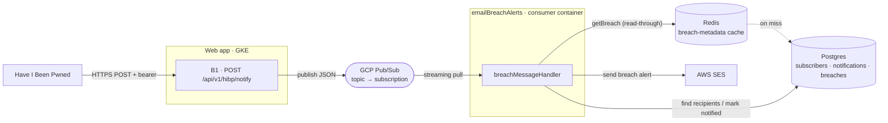
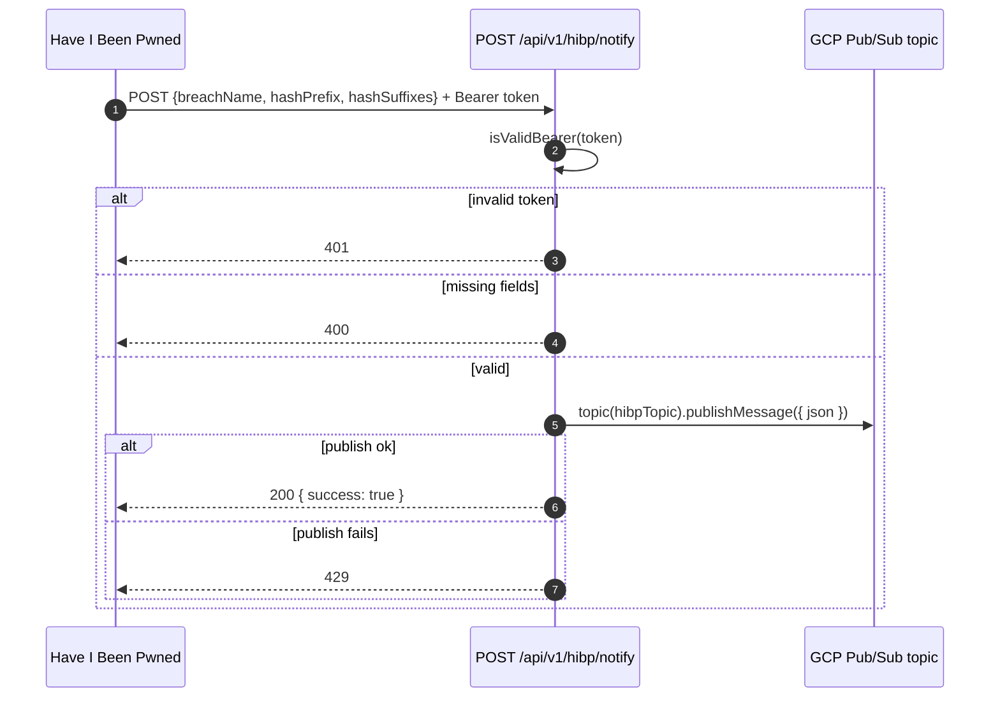
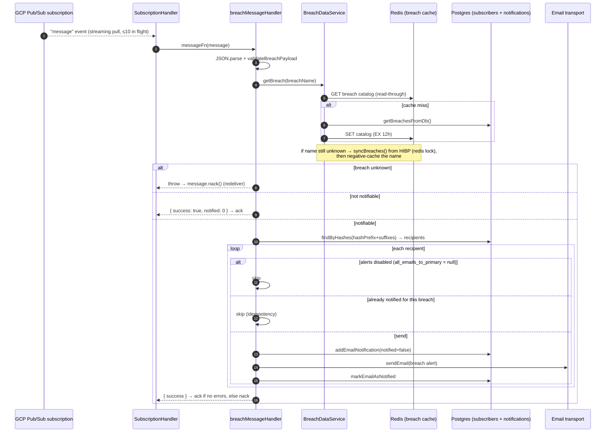

# Flow: Breach Alert Pipeline

When Have I Been Pwned (HIBP) detects a new breach, Monitor emails the affected subscribers.

This is the alerting side of the breach system. Monitor separately pulls the full breach catalog (and icons) from HIBP on a schedule — the [breach-sync-cron](./breach-sync-cron.md) flow. The two are independent HIBP integrations: that cron is Monitor-initiated; this pipeline is HIBP-initiated — HIBP POSTs to Monitor when a new breach matches a hash range Monitor has subscribed.

This system is deliberately split into two processes connected by a queue, so a burst of breach notifications can't overwhelm the system. See [ADR 0003 — Use a queue for backend services](../../adr/0003-use-queue-for-backend-services.md).

- **Producer**: the HIBP webhook handler. Validates the request and publishes a message. It does not send any email itself.
- **Consumer**: a separate long-running container that pulls messages off the subscription and does the heavy work of finding and emailing affected subscribers.

## Topology

## Producer: HIBP Notify Webhook

**Entrypoint**: [`hibp/notify/route.ts:34`](../../../src/app/api/v1/hibp/notify/route.ts#L34) (`POST`)

The handler is intentionally thin: no DB reads, no email — just auth + enqueue.

| Step                                                                                    | Code                                                            |
| --------------------------------------------------------------------------------------- | --------------------------------------------------------------- |
| Validate bearer token against `config.hibpNotifyToken` (bad → `401`)                    | [route.ts:43](../../../src/app/api/v1/hibp/notify/route.ts#L43) |
| Require `breachName`, `hashPrefix`, `hashSuffixes` (missing → `400`)                    | [route.ts:51](../../../src/app/api/v1/hibp/notify/route.ts#L51) |
| Publish JSON to topic `config.gcp.pubsub.hibpTopic` (ok → `200`, publish fails → `429`) | [route.ts:68](../../../src/app/api/v1/hibp/notify/route.ts#L68) |

## Queue Message Contract

The message is a `{ breachName, hashPrefix, hashSuffixes }` object: the producer's `PostHibpNotificationRequestBody` ([route.ts:22](../../../src/app/api/v1/hibp/notify/route.ts#L22)) and the consumer's `BreachMessagePayload` are the same shape.

`hashPrefix` plus each `hashSuffix` concatenate to the SHA-1 hashes of the breached accounts — HIBP's k-anonymity range, so HIBP sends hash ranges rather than raw emails, and the consumer matches them against `subscribers.primary_sha1`. HIBP knows to call Monitor at all because Monitor subscribes each verified email's hash range to HIBP at signup: `subscribeHash` → `POST /range/subscribe` ([hibp.ts:461](../../../src/utils/hibp.ts#L461), called from [emailAddresses.ts:267](../../../src/db/tables/emailAddresses.ts#L267)).

## Consumer: emailBreachAlerts Container

Entrypoint: [`emailBreachAlerts/index.ts:39`](../../../src/scripts/cronjobs/emailBreachAlerts/index.ts#L39) (`start()`) → [`emailBreachAlerts.tsx:270`](../../../src/scripts/cronjobs/emailBreachAlerts/emailBreachAlerts.tsx#L270) (`runJob()`) → [`subscriptionHandler.ts:45`](../../../src/scripts/cronjobs/emailBreachAlerts/subscriptionHandler.ts#L45) (`SubscriptionHandler`).

The diagram above shows the per-message ordering and branching. The anchors, plus the startup/subscribe detail the diagram omits:

| Step                                                                                               | Code                                                                                                    |
| -------------------------------------------------------------------------------------------------- | ------------------------------------------------------------------------------------------------------- |
| Startup — read `GCP_PUBSUB_*` env, init email transport / Redis / breach services, call `runJob()` | [index.ts:39](../../../src/scripts/cronjobs/emailBreachAlerts/index.ts#L39)                             |
| Subscribe — streaming pull, `flowControl.maxMessages = 10`, per-message Sentry isolation scope     | [emailBreachAlerts.tsx:270](../../../src/scripts/cronjobs/emailBreachAlerts/emailBreachAlerts.tsx#L270) |
| `breachMessageHandler` entry                                                                       | [emailBreachAlerts.tsx:112](../../../src/scripts/cronjobs/emailBreachAlerts/emailBreachAlerts.tsx#L112) |
| Parse + `validateBreachPayload`                                                                    | [emailBreachAlerts.tsx:122](../../../src/scripts/cronjobs/emailBreachAlerts/emailBreachAlerts.tsx#L122) |
| `getBreach(breachName)` — read-through cache (see [below](#breach-metadata-cache-redis))           | [emailBreachAlerts.tsx:128](../../../src/scripts/cronjobs/emailBreachAlerts/emailBreachAlerts.tsx#L128) |
| `breachIsNotifiable()`                                                                             | [emailBreachAlerts.tsx:135](../../../src/scripts/cronjobs/emailBreachAlerts/emailBreachAlerts.tsx#L135) |
| Build hashes from `hashPrefix + hashSuffixes`, `findByHashes()` → recipients                       | [emailBreachAlerts.tsx:157](../../../src/scripts/cronjobs/emailBreachAlerts/emailBreachAlerts.tsx#L157) |
| Per recipient: alerts-disabled skip                                                                | [emailBreachAlerts.tsx:170](../../../src/scripts/cronjobs/emailBreachAlerts/emailBreachAlerts.tsx#L170) |
| Per recipient: already-notified skip                                                               | [emailBreachAlerts.tsx:180](../../../src/scripts/cronjobs/emailBreachAlerts/emailBreachAlerts.tsx#L180) |
| Per recipient: `addEmailNotification` → `sendEmail` → `markEmailAsNotified`                        | [emailBreachAlerts.tsx:194](../../../src/scripts/cronjobs/emailBreachAlerts/emailBreachAlerts.tsx#L194) |

## Breach Metadata Cache (Redis)

`getBreach()` ([BreachDataService.ts:132](../../../src/services/BreachDataService.ts#L132)) resolves a breach name through a read-through ladder, short-circuiting at the first hit:

1. Negative cache — a name recently confirmed absent returns `undefined` without touching Postgres or HIBP ([:136](../../../src/services/BreachDataService.ts#L136)).
2. Redis catalog — read the `"breaches"` key; on a miss, query Postgres (`getBreachesFromDb`) and repopulate Redis with a 12-hour TTL ([:108](../../../src/services/BreachDataService.ts#L108), [:113](../../../src/services/BreachDataService.ts#L113)).
3. HIBP sync — if the name still isn't in the catalog, `syncBreaches()` pulls the latest list from HIBP into Postgres + Redis, under a Redis distributed lock so concurrent consumers don't all sync at once ([BreachSyncService.ts:110](../../../src/services/BreachSyncService.ts#L110), [:118](../../../src/services/BreachSyncService.ts#L118)).
4. Negative-cache write — still unknown after a sync → set a short-lived negative key (default 5 min, so a redelivery shortly after can pick up freshly-synced metadata) and return `undefined` ([:158](../../../src/services/BreachDataService.ts#L158)).

Step 3 is what makes the push safe to arrive before the pull: HIBP can POST a breach Monitor hasn't yet ingested (the breach-sync-cron runs only every 10 min), and the consumer pulls it just-in-time rather than waiting for the cron — and if even that sync doesn't have it yet, step 4's short negative TTL plus nack/retry let a redelivery pick it up once the metadata lands. That on-demand sync is serialized fleet-wide: the `SET NX` lock ([BreachSyncService.ts:118](../../../src/services/BreachSyncService.ts#L118)) lets only one caller across all pods fetch at a time, and a 5-minute freshness debounce ([:112](../../../src/services/BreachSyncService.ts#L112)) skips the sync entirely if one completed recently — so a burst of misses triggers at most one HIBP sync, at most once per 5 minutes.

> Important: Redis is the breach-metadata cache only. Subscribers, `email_notifications`, and the idempotency guard are always read from / written to Postgres — never cached. So a stale Redis cache can at worst delay recognizing a brand-new breach (until sync), never cause a duplicate or missed email.

## Delivery Semantics

The subscription is configured for exactly-once delivery, with bounded retries and a dead-letter topic (in `webservices-infra`: `tf/modules/monitor-www/main.tf`). `SubscriptionHandler` ([subscriptionHandler.ts:45](../../../src/scripts/cronjobs/emailBreachAlerts/subscriptionHandler.ts#L45)) drives ack/nack:

- Success (`{ success: true }`) → `message.ack()` ([:87](../../../src/scripts/cronjobs/emailBreachAlerts/subscriptionHandler.ts#L87)).
- Failure (`success: false` or a throw) → `message.nack()` ([:89](../../../src/scripts/cronjobs/emailBreachAlerts/subscriptionHandler.ts#L89), [:93](../../../src/scripts/cronjobs/emailBreachAlerts/subscriptionHandler.ts#L93)).
- Shutdown (SIGTERM/SIGINT) → in-flight messages are nack'd for redelivery to another instance ([:63–66](../../../src/scripts/cronjobs/emailBreachAlerts/subscriptionHandler.ts#L63), [:81](../../../src/scripts/cronjobs/emailBreachAlerts/subscriptionHandler.ts#L81)).

Exactly-once delivery means a successfully acked message is never redelivered, so a lost-ack race won't re-run the handler. But a nack or an expired ack deadline still triggers a retry (backoff 60s–600s), up to 5 attempts, after which the message goes to the dead-letter topic rather than retrying forever.

So the per-recipient `isSubscriberNotifiedForBreach` check is the idempotency guard for the _retry_ path, and it earns its place even under exactly-once delivery: the handler emails recipients one at a time, so a pod that crashes mid-loop — some emails sent, message not yet acked — gets the message redelivered and would re-email those recipients. The guard skips anyone already notified, so the same subscriber is never emailed twice for the same breach.
