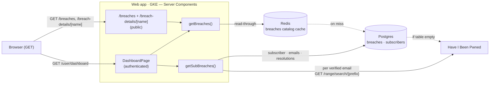
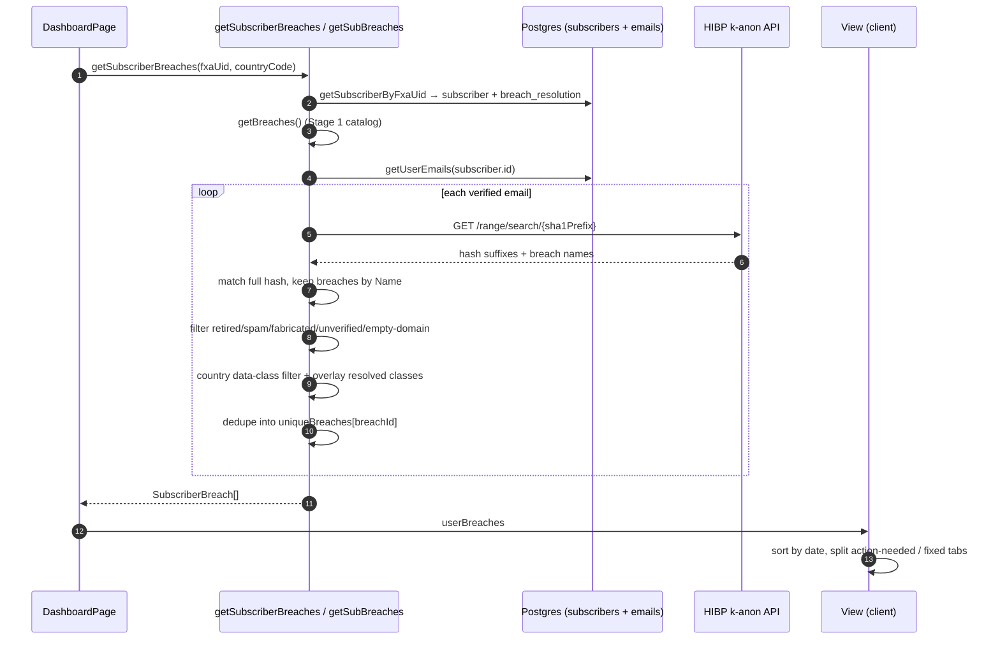

# Flow: Breach Read Path

When a browser requests a breach page, a Next.js Server Component renders it on the server and calls `getBreaches()` to read the cached breach catalog. The public pages show the whole catalog; the authenticated dashboard additionally matches it against the signed-in subscriber's emails.

This is the read side of the breach system. The catalog these pages read is populated by the [breach-sync-cron](./breach-sync-cron.md) flow, and new-breach alert emails are sent by the separate [breach-pipeline](./breach-pipeline.md) flow.

## Topology

## Stage 1 — Shared Catalog Read (`getBreaches`)

Entrypoint: [`getBreaches.ts:13`](../../../src/app/functions/server/getBreaches.ts#L13)

`getBreaches()` returns the entire breach catalog as `HibpLikeDbBreach[]`. It reads through Redis, and only contacts HIBP in the cold-start case where the `breaches` table is empty — normally the [breach-sync-cron](./breach-sync-cron.md) keeps that table populated, so this is a fallback, not the steady state.

| Step                                                                                                                                                        | Code                                                                                                                                          |
| ----------------------------------------------------------------------------------------------------------------------------------------------------------- | --------------------------------------------------------------------------------------------------------------------------------------------- |
| `getAllBreachesFromDb()` — read-through cache: read Redis key `"breaches"`; on a miss query Postgres `getAllBreaches()` and repopulate Redis with a 12h TTL | [hibp.ts:277](../../../src/utils/hibp.ts#L277), miss/set path [:290](../../../src/utils/hibp.ts#L290)–[:305](../../../src/utils/hibp.ts#L305) |
| Redis key/TTL constants — `REDIS_ALL_BREACHES_KEY = "breaches"`, `BREACHES_EXPIRY_SECONDS = 12h`                                                            | [redis/client.ts:10](../../../src/db/redis/client.ts#L10), [:12](../../../src/db/redis/client.ts#L12)                                         |
| Cold-start fallback only when the table is empty: `fetchHibpBreaches()` → `upsertBreaches()` → re-read                                                      | [getBreaches.ts:21](../../../src/app/functions/server/getBreaches.ts#L21)                                                                     |
| `dbToHibp` shapes each snake_case `BreachRow` into the PascalCase `HibpLikeDbBreach` the views consume                                                      | [hibp.ts:246](../../../src/utils/hibp.ts#L246), type [:224](../../../src/utils/hibp.ts#L224)                                                  |

This stage returns the catalog unfiltered — every row in the table, including retired/spam/fabricated/unverified breaches. Each surface decides what to filter: Stage 3 does, Stage 2 does not.

## Stage 2 — Public Breach Pages

Entrypoint: [`breaches/page.tsx:36`](<../../../src/app/[locale]/(redesign)/(public)/breaches/page.tsx#L36>)

Both public pages are thin Server Components: fetch the catalog, hand it to a client view.

| Step                                                                                                                                                           | Code                                                                                                                                                                                                       |
| -------------------------------------------------------------------------------------------------------------------------------------------------------------- | ---------------------------------------------------------------------------------------------------------------------------------------------------------------------------------------------------------- |
| List page: `getBreaches()` → `toSorted` by `AddedDate` newest-first → `BreachIndexView`                                                                        | [breaches/page.tsx:37](<../../../src/app/[locale]/(redesign)/(public)/breaches/page.tsx#L37>)                                                                                                              |
| `BreachIndexView` renders a `BreachCard` for **every** breach; the search box only toggles each card's CSS visibility (`matchesFilter`), it does not drop rows | [BreachIndexView.tsx:38](<../../../src/app/[locale]/(redesign)/(public)/breaches/BreachIndexView.tsx#L38>), card [:101](<../../../src/app/[locale]/(redesign)/(public)/breaches/BreachIndexView.tsx#L101>) |
| Detail page: `getBreaches()` → `getBreachByName()` (case-insensitive, with a `RENAMED_BREACHES` remap; 404 if not found) → `BreachDetailsView`                 | [breach-details/[breachName]/page.tsx:51](<../../../src/app/[locale]/(redesign)/(public)/breach-details/[breachName]/page.tsx#L51>), [hibp.ts:433](../../../src/utils/hibp.ts#L433)                        |
| `BreachLogo` renders the breach's `FaviconUrl`, or a colored first-letter fallback badge when it is null                                                       | [BreachLogo.tsx:24](../../../src/app/components/server/BreachLogo.tsx#L24)                                                                                                                                 |

> Important: the public `/breaches` page shows the raw catalog — unlike the dashboard, it applies none of the retired/spam/fabricated/unverified filtering from Stage 3.

## Stage 3 — Authenticated Dashboard (Per-User Matching)

Entrypoint: [`DashboardPage`](<../../../src/app/[locale]/(redesign)/(authenticated)/user/(dashboard)/dashboard/[[...slug]]/page.tsx#L32>) → [`getSubscriberBreaches`](../../../src/app/functions/server/getSubscriberBreaches.ts#L20)

The dashboard does not show "all breaches" — it shows the breaches the signed-in subscriber's verified emails appear in. It starts from the same `getBreaches()` catalog, then narrows it per email using HIBP's k-anonymity API (k-anon: HIBP returns a bucket of hash suffixes for a 6-char prefix, so Monitor never sends a full email or hash — the same mechanism the [breach-pipeline](./breach-pipeline.md#queue-message-contract) uses).

The diagram owns the ordering and the per-email loop; the table carries the anchors.

| Step                                                                                                                                                                                                                 | Code                                                                                                                                                                                                                               |
| -------------------------------------------------------------------------------------------------------------------------------------------------------------------------------------------------------------------- | ---------------------------------------------------------------------------------------------------------------------------------------------------------------------------------------------------------------------------------- |
| Load subscriber (includes the `breach_resolution` JSONB column)                                                                                                                                                      | [getSubscriberBreaches.ts:30](../../../src/app/functions/server/getSubscriberBreaches.ts#L30)                                                                                                                                      |
| Fetch catalog (Stage 1), then `getSubBreaches(subscriber, allBreaches, countryCode)`                                                                                                                                 | [getSubscriberBreaches.ts:34](../../../src/app/functions/server/getSubscriberBreaches.ts#L34)                                                                                                                                      |
| Per verified email: `getSha1(email)` → `getBreachesForEmail()` → `kAnonReq("/range/search/{prefix}")`, match full hash against suffixes, keep breaches whose `Name` is listed                                        | [subscriberBreaches.ts:94](../../../src/utils/subscriberBreaches.ts#L94), [hibp.ts:353](../../../src/utils/hibp.ts#L353), match loop [:400](../../../src/utils/hibp.ts#L400)                                                       |
| Filter out retired / spam / fabricated / unverified / empty-domain breaches (this path calls `getBreachesForEmail` with `filterBreaches=false`, so the filtering is the inline predicate, not `getFilteredBreaches`) | [subscriberBreaches.ts:100](../../../src/utils/subscriberBreaches.ts#L100)                                                                                                                                                         |
| Country-specific data-class filtering (e.g. SSN only where relevant)                                                                                                                                                 | [subscriberBreaches.ts:117](../../../src/utils/subscriberBreaches.ts#L117)                                                                                                                                                         |
| Overlay resolved data classes from `breach_resolution[email][breachId].resolutionsChecked`; dedupe a breach hit by multiple emails into one `SubscriberBreach`                                                       | [subscriberBreaches.ts:110](../../../src/utils/subscriberBreaches.ts#L110), merge [:160](../../../src/utils/subscriberBreaches.ts#L160)                                                                                            |
| `View` sorts by `addedDate`, splits into action-needed vs fixed tabs, renders an `ExposureCard` per breach                                                                                                           | [View.tsx:102](<../../../src/app/[locale]/(redesign)/(authenticated)/user/(dashboard)/dashboard/View.tsx#L102>), tab split [:115](<../../../src/app/[locale]/(redesign)/(authenticated)/user/(dashboard)/dashboard/View.tsx#L115>) |

> Important: breach resolutions are stored in `subscribers.breach_resolution` keyed by breach id, with `resolutionsChecked` holding indices into the recency-sorted breach list — never the raw account list. That is why `getBreachesForEmail` sorts matches by `AddedDate` and the code comment forbids changing that sort ([hibp.ts:409](../../../src/utils/hibp.ts#L409)): the indices are only meaningful against that exact ordering.

## Caching

> Important: `getBreaches()` itself holds no in-memory cache — it calls `getAllBreachesFromDb()` on every invocation and relies entirely on the Redis read-through. A module-level variable that cached the catalog across calls was removed in commit `0c5a85cb0` ("fix(getBreaches): don't cache breaches in variable") because it served stale data until process restart.

Two separate read-through implementations back the breach catalog, and they share the same Redis key (`"breaches"`) and 12h TTL:

- `getAllBreachesFromDb()` ([hibp.ts:277](../../../src/utils/hibp.ts#L277)) — used by `getBreaches()`, i.e. every read surface in this doc.
- `BreachDataService`'s read-through — used by the email pipeline's `getBreach(name)` (see [breach-pipeline.md](./breach-pipeline.md#breach-metadata-cache-redis)).

That key is written/refreshed by the [breach-sync-cron Cache Refresh stage](./breach-sync-cron.md#stage-3--cache-refresh). Because the key is shared, a stale or missing catalog can at worst delay a brand-new breach appearing on these pages until the next sync — never surface wrong data.

Only the catalog is cached. The dashboard's per-user match (Stage 3) is never cached — every dashboard load makes a live HIBP k-anon call per verified email, so who a subscriber matches is always recomputed.
