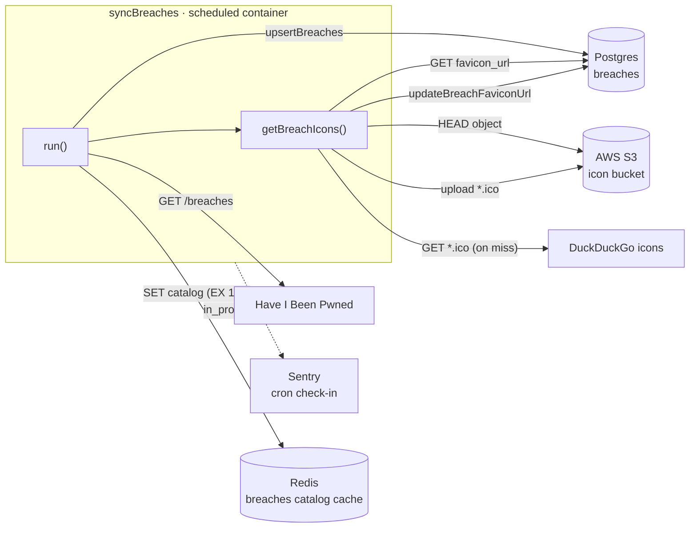
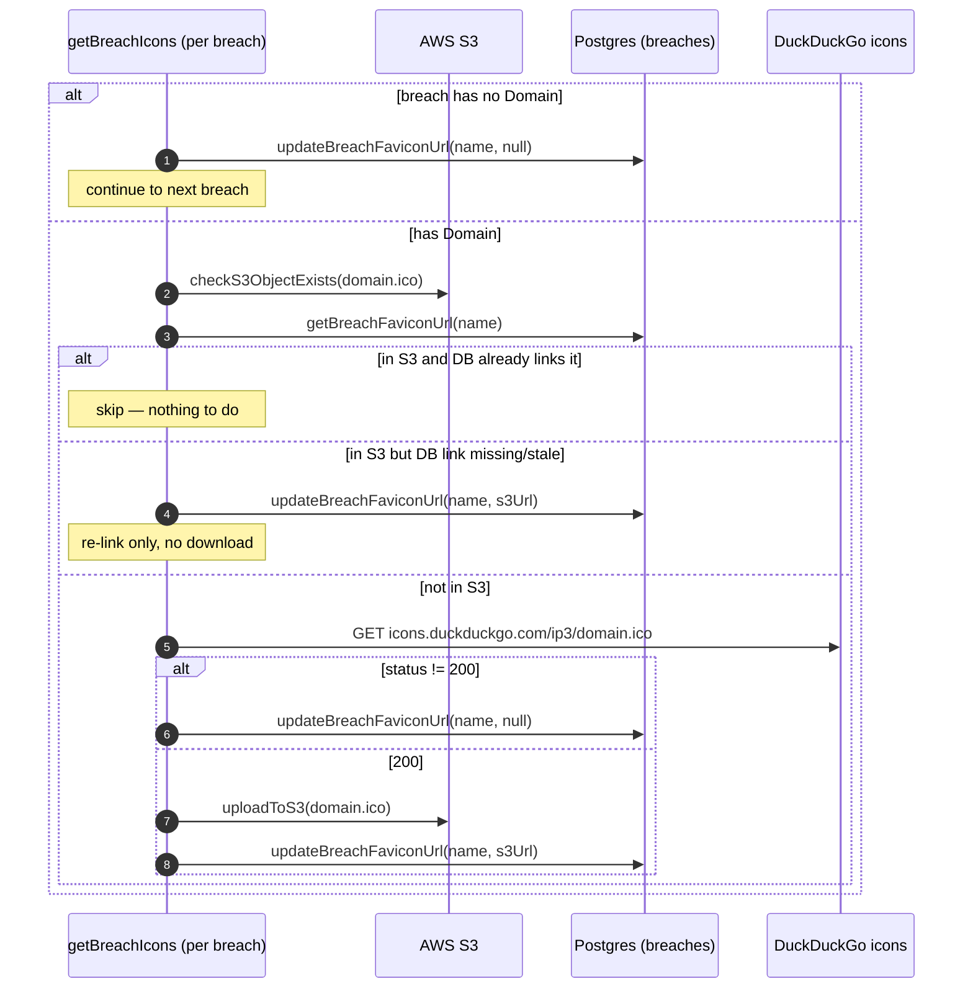

# Flow: Breach Sync Cron

A scheduled job pulls the full breach catalog from Have I Been Pwned (HIBP) into Monitor: it upserts every breach into Postgres, syncs each breach's icon into S3 blob storage, and refreshes the Redis catalog cache. This is how a brand-new breach (and its logo) becomes visible to the rest of Monitor.

This is the catalog-maintenance side of the breach system. The alerting side — emailing affected subscribers when HIBP reports a new breach — is the separate [breach-pipeline](./breach-pipeline.md) flow.

Two different things are named "syncBreaches". This doc covers the scheduled cron at [`src/scripts/cronjobs/syncBreaches/`](../../../src/scripts/cronjobs/syncBreaches/index.ts) — a clock-driven full pull that also syncs icons. The breach-pipeline doc references a different `syncBreaches()` on [`BreachSyncService`](../../../src/services/BreachSyncService.ts#L110): an on-demand, Redis-lock-guarded sync the consumer triggers when it hits an unknown breach name, and which does not touch icons. Both fetch `/breaches` from HIBP, upsert to Postgres, and refresh the same Redis catalog key.

## Topology

## Entrypoint and Schedule

The container runs `node dist/scripts/cronjobs/syncBreaches/index.js` ([package.json:28](../../../package.json#L28)). [`index.ts`](../../../src/scripts/cronjobs/syncBreaches/index.ts#L16) is a thin wrapper: it opens a Sentry cron check-in for slug `cron-sync-breaches`, calls `run()`, and reports `ok` or `error`. That check-in is the only failure signal for this job.

## Stage 1 — Fetch, Validate, and Upsert

Entrypoint: [`syncBreaches.ts:109`](../../../src/scripts/cronjobs/syncBreaches/syncBreaches.ts#L109) (`run()`)

`run()` pulls the whole breach list, runs two sanity checks that abort the job on bad data, then upserts into Postgres. The two checks are deliberately fatal: a corrupt or duplicated catalog throws rather than poisoning the database.

| Step                                                                                    | Code                                                                                                                                             |
| --------------------------------------------------------------------------------------- | ------------------------------------------------------------------------------------------------------------------------------------------------ |
| `fetchHibpBreaches()` — `GET /breaches` against `config.hibpApiRoot`                    | [syncBreaches.ts:111](../../../src/scripts/cronjobs/syncBreaches/syncBreaches.ts#L111), [hibp.ts:146](../../../src/utils/hibp.ts#L146)           |
| Per breach: `isValidBreach` field check; throw on a missing required field              | [syncBreaches.ts:117](../../../src/scripts/cronjobs/syncBreaches/syncBreaches.ts#L117)                                                           |
| Dedupe check on `Name + BreachDate`; throw if any duplicates                            | [syncBreaches.ts:130](../../../src/scripts/cronjobs/syncBreaches/syncBreaches.ts#L130)                                                           |
| `upsertBreaches()` — one transaction, per-row `INSERT ... ON CONFLICT (name) DO UPDATE` | [syncBreaches.ts:138](../../../src/scripts/cronjobs/syncBreaches/syncBreaches.ts#L138), [breaches.ts:35](../../../src/db/tables/breaches.ts#L35) |

## Stage 2 — Icon Sync (`getBreachIcons`)

Entrypoint: [`syncBreaches.ts:34`](../../../src/scripts/cronjobs/syncBreaches/syncBreaches.ts#L34)

For only breaches whose `.ico` is missing from S3 trigger a network download from DuckDuckGo.

The diagram owns the branching logic, while the table documents the anchors the diagram can't:

| Step                                                                                         | Code                                                                                                                                                                                                                                                            |
| -------------------------------------------------------------------------------------------- | --------------------------------------------------------------------------------------------------------------------------------------------------------------------------------------------------------------------------------------------------------------- |
| Build `logoFilename` (`domain.ico`) and the canonical `s3LogoUrl`                            | [syncBreaches.ts:46](../../../src/scripts/cronjobs/syncBreaches/syncBreaches.ts#L46)                                                                                                                                                                            |
| Existence check: `checkS3ObjectExists` (HEAD) + `getBreachFaviconUrl` (DB read)              | [syncBreaches.ts:50](../../../src/scripts/cronjobs/syncBreaches/syncBreaches.ts#L50), [s3.ts:66](../../../src/utils/s3.ts#L66), [breaches.ts:85](../../../src/db/tables/breaches.ts#L85)                                                                        |
| Already in S3 → skip, or re-link DB only (the common case after Stage 1's null)              | [syncBreaches.ts:53](../../../src/scripts/cronjobs/syncBreaches/syncBreaches.ts#L53), [:57](../../../src/scripts/cronjobs/syncBreaches/syncBreaches.ts#L57)                                                                                                     |
| Missing from S3 → fetch `.ico` from DuckDuckGo, then `uploadToS3` + `updateBreachFaviconUrl` | [syncBreaches.ts:66](../../../src/scripts/cronjobs/syncBreaches/syncBreaches.ts#L66), [:82](../../../src/scripts/cronjobs/syncBreaches/syncBreaches.ts#L82), [s3.ts:29](../../../src/utils/s3.ts#L29), [breaches.ts:79](../../../src/db/tables/breaches.ts#L79) |
| No domain, or non-200 from DuckDuckGo → set `favicon_url` null                               | [syncBreaches.ts:40](../../../src/scripts/cronjobs/syncBreaches/syncBreaches.ts#L40), [:69](../../../src/scripts/cronjobs/syncBreaches/syncBreaches.ts#L69)                                                                                                     |
| Per-breach `try/catch`: log + `captureException`, then continue                              | [syncBreaches.ts:91](../../../src/scripts/cronjobs/syncBreaches/syncBreaches.ts#L91)                                                                                                                                                                            |

Icon sync is best-effort and cannot fail the job. `run()` wraps the whole `getBreachIcons` call in its own `try/catch` ([syncBreaches.ts:141](../../../src/scripts/cronjobs/syncBreaches/syncBreaches.ts#L141)), and each breach is additionally guarded inside the loop. A breach whose icon fails to fetch keeps `favicon_url = null` and the job still upserts breach data and refreshes the cache — so an icon outage degrades to "no logo", never "no breach".

## Stage 3 — Cache Refresh

Entrypoint: [`syncBreaches.ts:150`](../../../src/scripts/cronjobs/syncBreaches/syncBreaches.ts#L150)

After upsert and icons, `run()` re-reads the full table and writes it to the Redis catalog key, so readers (including the breach-alert consumer) see the new breaches without a Postgres round-trip.

| Step                                                                 | Code                                                                                                                                              |
| -------------------------------------------------------------------- | ------------------------------------------------------------------------------------------------------------------------------------------------- |
| `getAllBreaches()` — re-read the table post-upsert                   | [syncBreaches.ts:150](../../../src/scripts/cronjobs/syncBreaches/syncBreaches.ts#L150), [breaches.ts:16](../../../src/db/tables/breaches.ts#L16)  |
| `SET breaches <json> EX 43200` (12h) on key `REDIS_ALL_BREACHES_KEY` | [syncBreaches.ts:159](../../../src/scripts/cronjobs/syncBreaches/syncBreaches.ts#L159), [redis/client.ts:10](../../../src/db/redis/client.ts#L10) |

The cache write is also best-effort: a Redis failure is logged + `captureException`'d but does not fail the job ([syncBreaches.ts:165](../../../src/scripts/cronjobs/syncBreaches/syncBreaches.ts#L165)). The catalog key carries a 12-hour TTL ([redis/client.ts:12](../../../src/db/redis/client.ts#L12)), so even if a refresh is skipped a stale entry expires on its own and the next read falls through to Postgres. This is the same key and TTL the breach-pipeline read-through ladder uses — see [breach-pipeline.md](./breach-pipeline.md#breach-metadata-cache-redis).
