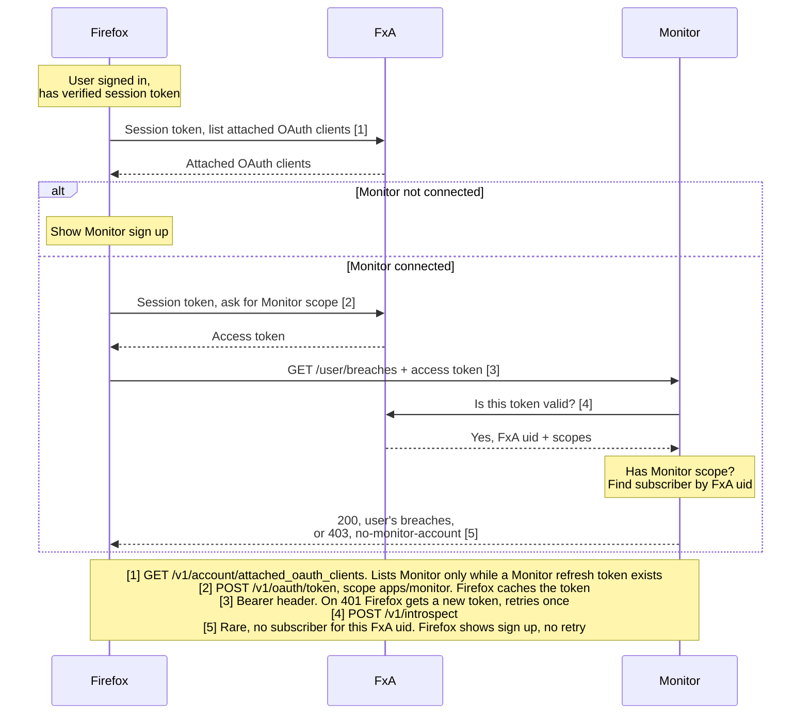
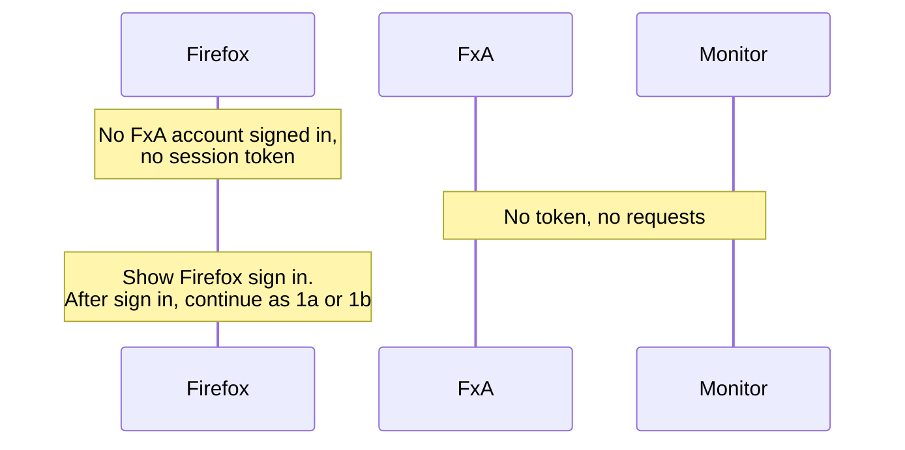

# Flow: Firefox API Auth

How Firefox authenticates to Monitor's Firefox API (`/api/firefox/v1`, see [`openapi.yml`](../../../openapi.yml)). Firefox sends an FxA access token carrying the `https://identity.mozilla.com/apps/monitor` scope, and Monitor introspects it with FxA on every request.

"Legacy" and "New" FxA auth differ only in how Firefox learns whether the user is connected to Monitor. "Legacy" holds a session token, which can mint any scope, so Firefox first checks `/account/attached_oauth_clients` for a Monitor refresh token. "New" holds a refresh token, and FxA's token endpoint returns 403 for the Monitor scope if the user hasn't authorized Monitor. Monitor's side is the same.

Today Desktop uses "Legacy" and Mobile uses "New". Desktop should switch to "New" by the end of Q4 2026.

## Two sign-ins

A person can be signed in to FxA in two separate places, possibly as different accounts.

|               | Firefox (browser)            | Monitor website                  |
| ------------- | ---------------------------- | -------------------------------- |
| Signed in via | Firefox settings (Sync)      | "Sign in" on monitor.mozilla.org |
| Holds         | FxA session or refresh token | Monitor session cookie           |
| Used by       | `/api/firefox/v1`            | The website and `/api/v1`        |

**The Firefox API uses the Firefox sign-in only. It maps the token's FxA uid to a subscriber with [`getSubscriberByFxaUid`](../../../src/db/tables/subscribers.ts#L55), and ignores any Monitor website session. Below, "has Monitor" means a subscriber row exists for the Firefox account's FxA uid, created the first time that account signed in to the Monitor website.**

## Flows

Diagrams show `GET /user/breaches`. `POST /user/breaches/resolutions` authenticates the same way.

|                                | "Legacy" auth           | "New" auth              |
| ------------------------------ | ----------------------- | ----------------------- |
| Firefox account has Monitor    | [1a](#1a-1b-signed-in)  | [2a](#2a-2b-signed-in)  |
| Firefox account has no Monitor | [1b](#1a-1b-signed-in)  | [2b](#2a-2b-signed-in)  |
| Not signed in to Firefox       | [1c](#1c-not-signed-in) | [2c](#2c-not-signed-in) |

1a and 1b share one diagram. 1b is either path to "Show Monitor sign up". Same for 2a and 2b.

## "Legacy" Auth

### 1a, 1b. Signed in

### 1c. Not signed in

## "New" Auth

### 2a, 2b. Signed in

TODO

### 2c. Not signed in

TODO
