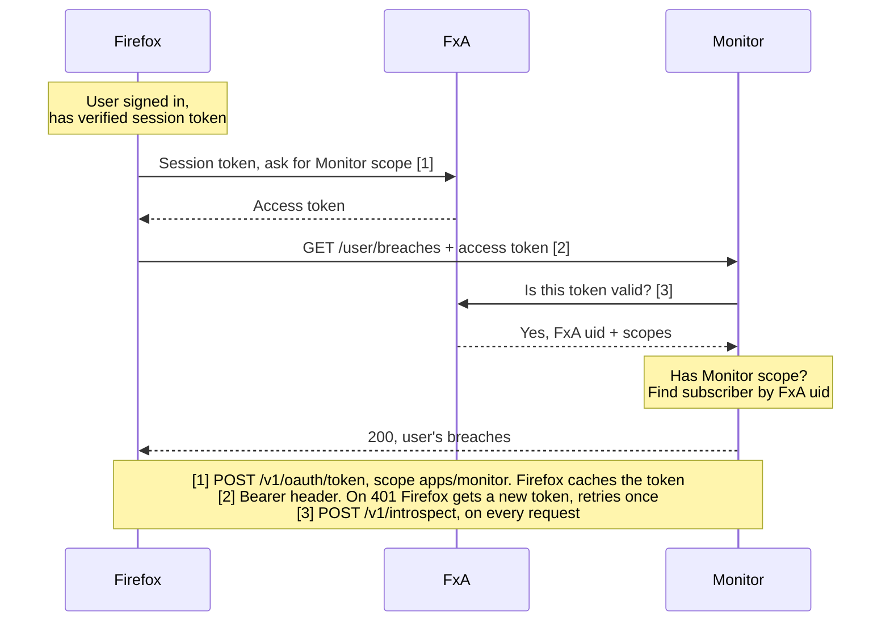
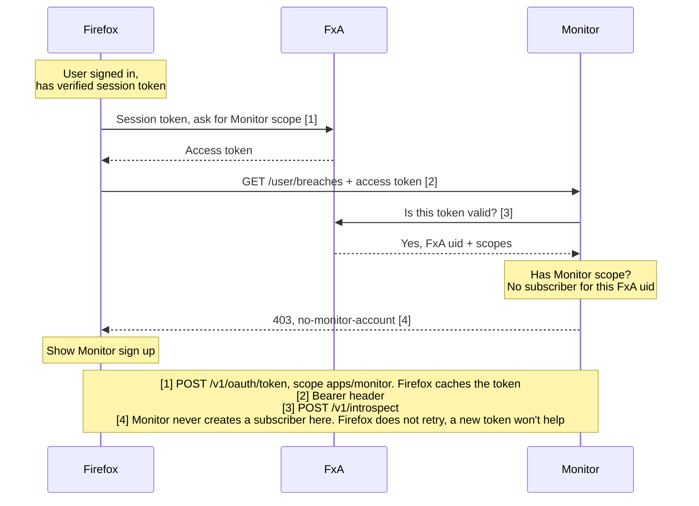
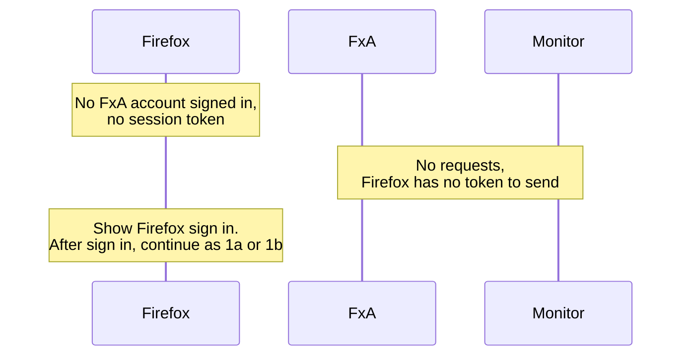

# Flow: Firefox API Auth

How Firefox authenticates to Monitor's Firefox API (`/api/firefox/v1`, see [`openapi.yml`](../../../openapi.yml)). Firefox sends an FxA access token carrying the `https://identity.mozilla.com/apps/monitor` scope, and Monitor introspects it with FxA on every request.

Legacy and new FxA auth differ only in how Firefox gets its access token: legacy holds a session token, new holds an OAuth refresh token. Monitor's side is the same.

## Two sign-ins

A person can be signed in to FxA in two separate places, possibly as different accounts.

|               | Firefox (browser)            | Monitor website                  |
| ------------- | ---------------------------- | -------------------------------- |
| Signed in via | Firefox settings (Sync)      | "Sign in" on monitor.mozilla.org |
| Holds         | FxA session or refresh token | Monitor session cookie           |
| Used by       | `/api/firefox/v1`            | The website and `/api/v1`        |

The Firefox API uses the Firefox sign-in only. It maps the token's FxA uid to a subscriber with [`getSubscriberByFxaUid`](../../../src/db/tables/subscribers.ts#L55), and ignores any Monitor website session. Below, "has Monitor" means the Firefox account has signed in to the Monitor website at least once.

For example, Firefox signed in as `work@`, Monitor website as `personal@`:

| `work@` has Monitor? | Result                                                                   |
| -------------------- | ------------------------------------------------------------------------ |
| Yes                  | [1a](#1a-signed-in-has-monitor), `work@`'s breaches                      |
| No                   | [1b](#1b-signed-in-no-monitor), 403, even though `personal@` has Monitor |

## Flows

|                                | Legacy auth                     | New auth                        |
| ------------------------------ | ------------------------------- | ------------------------------- |
| Firefox account has Monitor    | [1a](#1a-signed-in-has-monitor) | [2a](#2a-signed-in-has-monitor) |
| Firefox account has no Monitor | [1b](#1b-signed-in-no-monitor)  | [2b](#2b-signed-in-no-monitor)  |
| Not signed in to Firefox       | [1c](#1c-not-signed-in)         | [2c](#2c-not-signed-in)         |

## Legacy Auth

### 1a. Signed in, has Monitor

### 1b. Signed in, no Monitor

Also covers the Monitor website being signed in to a different FxA account, see [Two sign-ins](#two-sign-ins).

### 1c. Not signed in

## New Auth

### 2a. Signed in, has Monitor

TODO

### 2b. Signed in, no Monitor

TODO

### 2c. Not signed in

TODO
