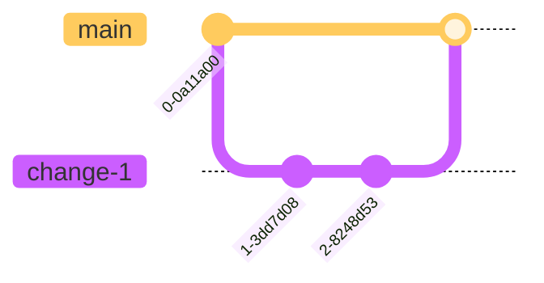

# Release Process

## Environments

- [Production][prod] - Run manually by ENGR team (unless we need Env Var or other infrastructure changes)
- [Stage][stage] - Run automatically on PR merges
- Locals: Run by ENGRs on their own devices. (See [README][readme] and other [`docs/`][docs].)

## Development

Standard Monitor development follows a branching strategy similar to
[GitHub Flow][github-flow], where all branches stem directly from `main` and
are merged back to `main`:

1. Create a branch from `main`
2. Make changes
3. Create a pull request to `main`
4. Address review comments
5. Merge the pull request

This means many features could be in development at the same time, and all can
merge back to `main` when they are ready.

## Release Timeline

The standard release interval for Monitor is one week, meaning there should be at least one new version of the Monitor web app on the [Production][prod] environment. However, since we've started doing 1-click deploy to production, our release cycle can become more and more frequent.

## Release to Stage

Every commit to `main` is automatically deployed to the [Stage][stage] server via Github Actions. The image is built and uploaded to Google Artifact Registry. ArgoCD scans the registry and detects whenever a new image uploaded with a tag that is a short commit SHA. When one is detected, it triggers a new deployment. This is configured via the [Monitor tenant definition](https://github.com/mozilla/global-platform-admin/blob/main/tenants/monitor.yaml).

### PR Merges

PRs can only be merged once they pass all the required checks:

- Lint
- Build
- Unit Tests
- E2E Tests

A PR also needs at least one approval from an ENGR team member to be merged into `main`.

Once a PR is successfully merged:

1. Ensure that the merge commit in `main` branch passes all checks and a docker image is successfully deployed to [GAR](https://console.cloud.google.com/artifacts/docker/moz-fx-monitor-prod/us/monitor-prod/blurts-server?project=moz-fx-monitor-prod).
2. A webhook will send status messages into the `#fx-monitor-engineering` channel when the deployment is completed. If after a few minutes you don't see a deployment notification, check [ArgoCD](https://webservices.argocd.global.mozgcp.net/applications?search=monitor&showFavorites=false&proj=&sync=&autoSync=&health=&namespace=&cluster=&labels=) to ensure that there aren't errors preventing deployment. You may also attempt to manually sync through the UI.

## Release to Production

### Daily pre-releases

Github pre-releases are generated daily via a [daily-pre-release](daily-pre-release) GHA workflow.
The pre-release will include all the PRs that got merged into main (stage) that day.
The cron job will only execute Monday to Friday.
As a base load engineer, you can get into a habit of checking pre-releases every morning to see what's been pushed and what's been checked by the QAs. Once everything is checked off in a pre-release, we can proceed to deploying that pre-release to production and mark it as the latest

### Deploy to Production

Before deploying to production, we need to assess the current state of our work on stage. We need to cross-reference what's already on stage and what's been greenlit by QA. To do this, we need to find the difference between what was released last time in production and what we currently have on stage.

### Mark pre-release as latest, check the diff in Release Notes, and notify the team

1. Find the pre-release/tag you want to use for the deploy (e.g., `2024.09.01`)
2. Edit the release
3. Check the checkbox `Set as the latest release`
4. Copy and Paste the release notes in the engineering slack channel so the team is aware
5. Go through the PRs, cross-reference the tickets in the PRs with the [Jira][jira] board to see if QA has approved the tickets. If anything is unclear, make sure to tag the author of the PR.
6. If anything has not been properly tested, make a note, and again, double check with the person
7. If everything looks good, proceed to release, otherwise refer to the section `Stage-fixes` below.

### Update Production Environment Variables

Environment variables are configured in 3 places:

- Secret env vars via [Secret Manager](https://console.cloud.google.com/security/secret-manager)
- Non-secret env vars via Helm [ConfigMap](https://github.com/mozilla/webservices-infra/tree/main/monitor/k8s/monitor-www)
- Terraform-generated secrets in [terraform folder](https://github.com/mozilla/webservices-infra/tree/main/monitor/tf)

Any changes directly to production should be done as a pairing session with another engineer. By default, engineers do not have access to production-level secrets. In order to make changes:

- Share your screen with your pairing partner
- Use [PAM](https://console.cloud.google.com/iam-admin/pam/entitlements/) to request 'secret-add-access' access grant for the minimum length of time required to complete your update
- Copy the latest secrets version into a new version
- Update the necessary variables
- Review with your pairing partner before accepting

New secrets are discovered automatically by ArgoCD every 5 minutes. That means they are synced to the infrastructure and will be used when a new pod created. However, new secrets will _not_ be automatically pulled into currently running pods. They will only be updated when the pods are restarted or the service redeployed (this includes new cron job instances). If you want to use updated secrets in currently running pods, you must restart them manually.

To restart the pods for the monitor web application, navigate to [ArgoCD](https://webservices.argocd.global.mozgcp.net/applications?search=monitor) and select the project for the appropriate environment. Find the rollout resources `monitor-api-deployment` and `monitor-www`. On each node, click the hamburger menu and select "restart pods". ArgoCD will spin up new pods and terminate the existing ones. This could take up to several minutes in production; you can keep an eye on the progress by clicking on the node, then switching to the "Rollout" tab. The new pods will have the updated environment variables.

### 1-click Production Release

After you push the tag to GitHub, you should also
[make a release on GitHub][github-new-release] for the tag.

1. After all the checks above look good, click "Publish release"
2. Go to the `main` branch and make sure all the checks succeeded
3. Run the [V2 cron][v2] against stage and make sure it succeeded.
4. Run [E2E cron][e2e] against stage (with the latest update)
   - if there are errors, make sure the cause is understood
   - fix the e2e errors or change the tests when appropriate before proceeding
5. Check the stage Sentry and GCP error logs
6. Run [1-Click Deploy Github Action][1-click deploy]
   - Click on `Run workflow`
   - `Branch:main` is selected
   - `prod` is selected for environment
   - Input the tag created earlier (today's date, e.g., `2024.09.01`)
   - Click on `Run workflow` when ready. This will add a new tag like `<environment-prefix>-<selected-tag>`, e.g. `prod-2024.09.1` or `dev-abc123d`. The tagged image will be picked up and deployed by ArgoCD automatically.
7. A webhook will send status messages into the `#fx-monitor-engineering` channel.
8. After successful deploy, conduct some basic sanity check:
   - Check sentry prod project for a spike in any new issues
   - Check [grafana dashboard][grafana-dashboard] for any unexpected spike in ops
   - Spot-check the site for basic functionality

Note the following caveats:

- All production releases must follow the date tag naming scheme or else they will not be deployed. The regex for image deployments is in the [monitor tenant definition file](https://github.com/mozilla/global-platform-admin/blob/main/tenants/monitor.yaml).
  - Example: `2024.09.01`; also can include additional numeric suffix preceded by a period, e.g. `2024.09.01.1` (for manually created deployments, typically hotfixes)
- You can deploy to dev with this flow. Select "dev" from the environment dropdown menu and ensure the tag you input is a (previously deployed) short commit SHA, not one of the date tags.
- Only commits which have already been deployed to staging can be released to development or production environments. In practice this means that you cannot and should not attempt to deploy from a tag created on a release branch
<!-- 
Note: The reason that this is the case currently is due to a race condition with the on-push triggered jobs release_retag_v2 and docker_build_deploy_v2. The release_retag_v2 action attempts to pull an image uploaded by docker_build_deploy_v2 immediately, even though the job is not complete. However, the new tag _will_ create a staging release (tagged by the short commit SHA) that will override the current staging environment. This could result in confusion about the state of staging environment and commit verification by QA.

A prod release could be forced by re-running the failed release_retag_v2 job after docker_build_deploy_v2 completes, but this should be the exception, and you should make sure to merge the release branch back into `main` afterwards to prevent it from being unintentionally reverted.

Also note that any migrations already in `main` should also be included in your release branch.
-->

### Update Jira

On our [Jira][jira] board, review the tickets listed under "Merged to main." If those were included in the release you just created, drag those tickets to either the "Promoted to Prod" or "Done" column. This will notify QA that they can verify the behavior on Prod if necessary.

If you're unsure whether a ticket was included in the release, ask the assigned person to move it if needed.

### Deploying hotfixes

In the case of time-sensitive hotfixes or dependency updates, you may need to deploy before the daily cron job creates a pre-release.

- Find a pairing partner to assist you with review and approval
- Via PR, revert changes which have not yet been QA-verified on main (if applicable)
- Follow typical development flow for hotfix changes: make new branch, commit changes, create PR, get approval, and merge to main
- Test hotfix on staging environment with your pairing partner
- Notify the team that you are deploying a hotfix in the `#monitor-core-team` slack channel
- With your pairing partner, create a new tag from the hotfix commit and mark it as the latest release
  - Use the date-formatted tag with an additional numeric suffix (e.g. `2024.02.27.1`) to differentiate this manual patch from the automatically generated cron prereleases
- Follow instructions in [Release to Production](#release-to-production) to deploy the tag you created to prodution using the 1-click release workflow
- Make a PR to re-revert the reverted changes (putting them back in main branch) and merge it in after approval
  - Complete this step as soon as possible to avoid merge conflicts

## Stage-fixes

Ideally, every change can ride the regular weekly release "trains". But sometimes, not everything in `main` can go out. Since we've adopted feature flags, these scenarios are becoming rarer. However, we still cannot guarantee that they never happen.

Wherever feature flags aren't applicable, there are generally two scenarios we need to consider:

1. If the diff in changes is minimal (eg. can be traced back to a PR or two), revert the changes which should not yet be released
2. If the diff is not minimal, or a significant portion of the tickets haven't been QA'd, we can choose to
   - delay the release (ask the team for consensus)
   - release from an earlier qa-verified commit (this works as long as there aren't urgent hotfixes/dependency updates which also need to be released)

### Revert

1. Revert the PR(s)
2. Create a Github [Release][github-new-release]
3. Revert the revert after production deployment is successful
   - After the revert of revert is successfully merged into `main`, stage should be automatically put back to the state before Production release

## Future

After adding 1-click production deploy capability and broadly adopting [feature flags][feature-flags], we are looking into ways to increase our production release frequency. The main challenge here is to coordiate our QA effort with our latest stage CICD deployments.

[prod]: https://monitor.firefox.com/
[stage]: https://stage.firefoxmonitor.nonprod.cloudops.mozgcp.net/
[readme]: https://github.com/mozilla/blurts-server/blob/main/README.md
[docs]: https://github.com/mozilla/blurts-server/tree/main/docs
[github-flow]: https://docs.github.com/en/get-started/quickstart/github-flow
[github-new-release]: https://github.com/mozilla/blurts-server/releases/new
[grafana-dashboard]: https://earthangel-b40313e5.influxcloud.net/d/dEpkGp4Wz/fx-monitor?orgId=1&from=now-7d&to=now
[e2e]: https://github.com/mozilla/blurts-server/actions/workflows/e2e_cron.yml
[v2]: https://github.com/mozilla/blurts-server/actions/workflows/release_retag_v2.yaml
[jira]: https://mozilla-hub.atlassian.net/jira/software/c/projects/MNTOR/boards/447
[1-click deploy]: https://github.com/mozilla/blurts-server/actions/workflows/production_deploy.yml
