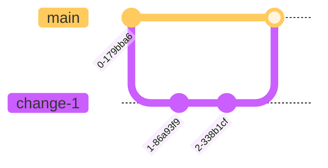
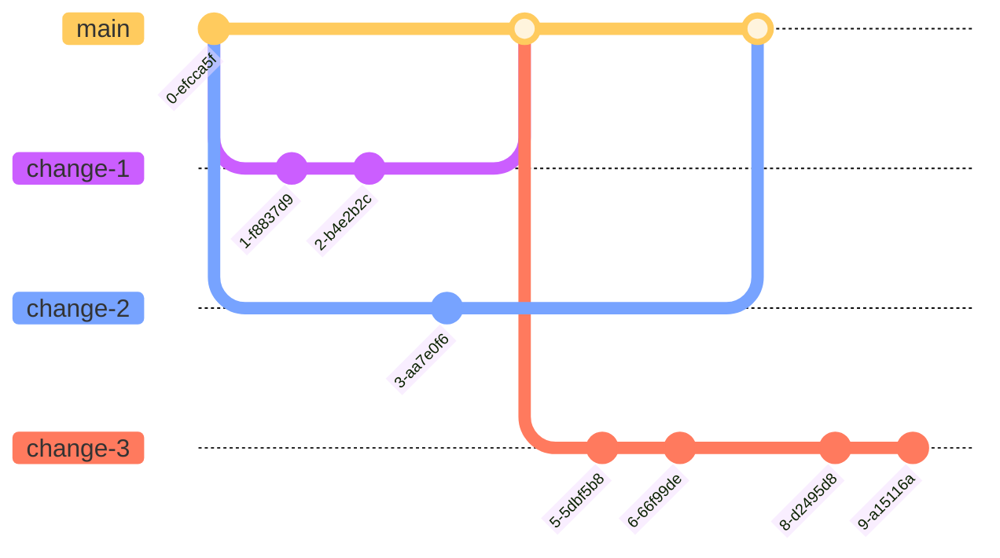

# Release Process

## Environments

- [Production][prod] - Run manually by ENGR team (unless we need Env Var or other infrastructure changes)
- [Stage][stage] - Run automatically on PR merges
- Locals: Run by ENGRs on their own devices. (See [README][readme] and other [`docs/`][docs].)

## Development

Standard Monitor development follows a branching strategy similar to
[GitHub Flow][github-flow], where all branches stem directly from `main` and
are merged back to `main`:

1. Create a branch from `main`
2. Make changes
3. Create a pull request to `main`
4. Address review comments
5. Merge the pull request

This means many features could be in development at the same time, and all can
merge back to `main` when they are ready.

## Release Timeline

The standard release interval for Monitor is one week, meaning there should be at least one new version of the Monitor web app on the [Production][prod] environment. However, since we've started doing 1-click deploy to production, our release cycle can become more and more frequent.

## Preview Deployment

Every time a PR is opened, a docker image is created and deployed to the
preview deployment environment powered by GCP Cloud Run / CloudSQL.
A brand new database is created and schema is migrated specific to that PR.
A brand new Cloud Run service is set up and cleaned up along with the
database at the end of the lifecycle of that PR (when closed or merged).
A preview URL is generated and linked in the PR when the environment is
set up and changes are ready to be reviewed.

## Release to Stage

Every commit to `main` is automatically deployed to the [Stage][stage] server via Github Actions and Jenkins.

### PR Merges

PRs can only be merged once they pass all the required checks:

- Lint
- Build
- Unit Tests
- E2E Tests
- Deploy Previews

A PR also needs at least one approval from an ENGR team member to be merged into `main`.

Once a PR is successfully merged:

1. ensure that the merge commit in `main` branch passes all checks and a docker image is successfully deployed.
2. Jenkins will kick off the deployment of the latest built docker image to stage environment
3. A webhook will send status messages into the `#fx-monitor-engineering` channel.
   - Watch for messages: `pushing to staging started` and `successfully deployed to staging`

## Release to Production

### Daily pre-releases

Github pre-releases are generated daily via a (daily-pre-release)[daily-pre-release] GHA workflow.
The pre-release will include all the PRs that got merged into main (stage) that day.
The cron job will only execute Monday to Friday.
As a base load engineer, you can get into a habit of checking pre-releases every morning to see what's been pushed and what's been checked by the QAs. Once everything is checked off in a pre-release, we can proceed to deploying that pre-release to production and mark it as the latest

### Deploy to Production

Before deploying to production, we need to assess the current state of our work on stage. We need to cross-reference what's already on stage and what's been greenlit by QA. To do this, we need to find the difference between what was released last time in production and what we currently have on stage.

### Mark pre-release as latest, check the diff in Release Notes, and notify the team

1. Find the pre-release/tag you want to use for the deploy (e.g., `2024.09.01`)
2. Edit the release
3. Check the checkbox `Set as the latest release`
4. Copy and Paste the release notes in the engineering slack channel so the team is aware
5. Go through the PRs, cross-reference the tickets in the PRs with the [Jira][jira] board to see if QA has approved the tickets. If anything is unclear, make sure to tag the author of the PR.
6. If anything has not been properly tested, make a note, and again, double check with the person
7. If everything looks good, proceed to release, otherwise refer to the section `Stage-fixes` below.

### Update Production Environment Variables

In the cases where we need to update or add new environment variables, we need to get help from SRE:

1. File an [SRE ticket][sre-board] for the env var change.
   - In the title, make sure to mention "Production"
   - Make sure to include the value and the correct variable name
   - Make sure to specify if it's a `secret` or a regular variable
2. When appropriate, wait for SRE to make the changes before proceeding with the production release.

### 1-click Production Release

After you push the tag to GitHub, you should also
[make a release on GitHub][github-new-release] for the tag.

1. After all the checks above look good, click "Publish release"
2. Go to the `main` branch and make sure all the checks succeeded
3. Run the [V2 cron][v2] against stage and make sure it succeeded.
4. Run [E2E cron][e2e] against stage (with the latest update)
   - if there are errors, make sure the cause is understood
   - fix the e2e errors or change the tests when appropriate before proceeding
5. Check the stage Sentry and GCP error logs
6. Run [1-Click Deploy Github Action][1-click deploy]
   - Click on `Run workflow`
   - `Branch:main` is selected
   - `prod` is selected for environment
   - Input the tag created earlier (today's date, e.g., `2024.09.01`)
   - Click on `Run workflow` when ready
7. A webhook will send status messages into the `#fx-monitor-engineering` channel.
   - Watch for messages: `pushing to production started` and `successfully deployed to production`
8. After successful deploy, conduct some basic sanity check:
   - Check sentry prod project for a spike in any new issues
   - Check [grafana dashboard][grafana-dashboard] for any unexpected spike in ops
   - Spot-check the site for basic functionality

### Update Jira

On our [Jira][jira] board, review the tickets listed under "Merged to main." If those were included in the release you just created, drag those tickets to either the "Promoted to Prod" or "Done" column. This will notify QA that they can verify the behavior on Prod if necessary.

If you're unsure whether a ticket was included in the release, ask the assigned person to move it if needed.

## Stage-fixes

Ideally, every change can ride the regular weekly release "trains". But sometimes, not everything in `main` can go out. Since we've adopted feature flags, these scenarios are becoming rarer. However, we still cannot guarantee that they never happen.

Wherever feature flags aren't applicable, there are generally two scenarios we need to consider:

1. If the diff in changes is minimal (eg. can be traced back to a PR or two), the easiest way is to revert
2. If the diff is not minimal, or a significant portion of the tickets haven't been QA'd:
   - we can choose to delay the release (ask the team for consensus)
   - we can create a separate release branch

### Revert

1. Revert the PR(s)
2. Create a Github [Release][github-new-release]
3. Revert the revert after production deployment is successful
   - After the revert of revert is successfully merged into `main`, stage should be automatically put back to the state before Production release

### Separate release branch

1. Create a branch on top of `main`
2. Work on taking out the features that should not be included (not feature-flagged)
3. Create a Github [Release][github-new-release]
   - In the release, make sure to pick your branch (`main` is default)
   - Generate the release note, double check and make sure that it makes sense
4. Proceed with the production release

## Future

After adding 1-click production deploy capability and broadly adopting [feature flags][feature-flags], we are looking into ways to increase our production release frequency. The main challenge here is to coordiate our QA effort with our latest stage CICD deployments.

[prod]: https://monitor.firefox.com/
[stage]: https://stage.firefoxmonitor.nonprod.cloudops.mozgcp.net/
[readme]: https://github.com/mozilla/blurts-server/blob/main/README.md
[docs]: https://github.com/mozilla/blurts-server/tree/main/docs
[github-flow]: https://docs.github.com/en/get-started/quickstart/github-flow
[sre-board]: https://mozilla-hub.atlassian.net/jira/software/c/projects/SVCSE/boards/316
[github-new-release]: https://github.com/mozilla/blurts-server/releases/new
[grafana-dashboard]: https://earthangel-b40313e5.influxcloud.net/d/dEpkGp4Wz/fx-monitor?orgId=1&from=now-7d&to=now
[e2e]: https://github.com/mozilla/blurts-server/actions/workflows/e2e_cron.yml
[v2]: https://github.com/mozilla/blurts-server/actions/workflows/release_retag_v2.yaml
[jira]: https://mozilla-hub.atlassian.net/jira/software/c/projects/MNTOR/boards/447
[dockerhub]: https://hub.docker.com/r/mozilla/blurts-server/tags
[1-click deploy]: https://github.com/mozilla/blurts-server/actions/workflows/production_deploy.yml
[daily-pre-release]: https://github.com/mozilla/blurts-server/actions/workflows/release_cron_daily.yml
