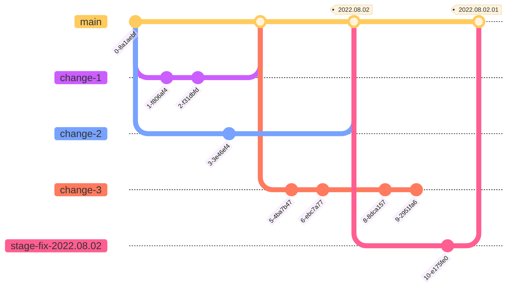
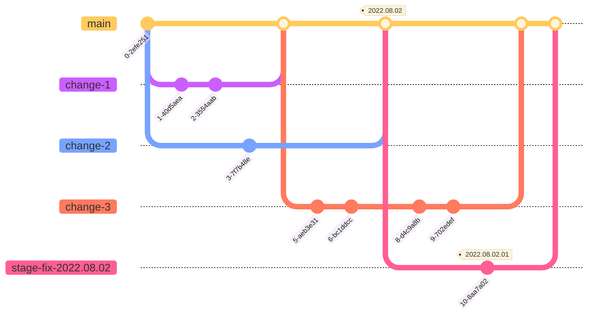

# Release Process

## Environments

- [Production][prod] - Run by SRE team in GCP
- [Stage][stage] - Run by SRE team in GCP
- [Dev][dev] - Run by ENGR team in Heroku
- Locals: Run by ENGRs on their own devices. (See [README][readme] and other [`docs/`][docs].)

## Code branches

Standard Monitor development follows a branching strategy similar to
[GitHub Flow][github-flow], where all branches stem directly from `main` and
are merged back to `main`:

1. Create a branch from `main`
2. Make changes
3. Create a pull request to `main`
4. Address review comments
5. Merge pull request

This means many features could be in development at the same time, and all can
merge back to `main` when they are ready.

## Release Timeline

The standard release interval for Monitor is 1 week, meaning every week there
will be a new version of the Monitor web app on the [Production][prod]
environment. To do this, we first release code to [Dev][dev] and
[Stage][stage].

## Preview Deployment

Every time a PR is open, a docker image is created and deployed to the
preview deployment environment powered by GCP Cloud Run / CloudSQL.
A brand new database is created and schema is migrated specific to that PR.
A brand new Cloud Run service is set up and cleaned up along with the
database at the end of the lifecycle of that PR (when closed or merged).
A preview URL is generated and linked in the PR when the environment is
set up and changes are ready to be reviewed.

## Release to Stage

Every commit to `main` is automatically deployed to the [Stage][stage] server
via Github Actions and Jenkins.

### Create Release Notes on GitHub

After you push the tag to GitHub, you should also
[make a pre-release on GitHub][github-new-release] for the tag.

1. Choose the tag you just pushed (e.g., `2022.08.02`)
2. Type the same tag name for the release title (e.g., `2022.08.02`)
3. Click "Previous tag:" and choose the tag currently on production.
   - You can find this at [the `__version__` endpoint][prod-version].
4. Click the "Generate release notes" button!
5. Check the pre-release box.
6. Click "Publish release"

### Update Jira

On [our Jira board](https://mozilla-hub.atlassian.net/jira/software/c/projects/MNTOR/boards/447), take a look at the tickets listed under "Merged tot main". If those were included in the release you just created, drag those tickets to the "Done" column, in the "Merged" section (sections will appear as you start dragging). This will notify QA that they can verify the behaviour on stage.

If you're unsure whether a ticket was included in the release, ask the person it is assigned to to move it if needed.

## Release to Prod

We leave the tag on [Stage][stage] for a week so that we (and especially QA)
can check the tag on GCP infrastucture before we deploy it to production. To
deploy the tag to production:

1. Run [e2e] tests against the stage
   - Ensure the tests are successful / Resolve any issues before moving to the next step
2. File an [SRE ticket][sre-board] to deploy the tag to [Prod][prod].
   - Include a link to the GitHub Release
   - Include a link to successful e2e tests
   - You can assign it directly to our primary SRE for the day
3. When SRE starts the deploy, "cloudops-jenkins" will send status messages
   into the #fx-monitor-engineering channel.
4. When you see `PROMOTE PROD COMPLETE`, do some checks on prod:
   - Check sentry prod project for a spike in any new issues
   - Check [grafana dashboard][grafana-dashboard] for any unexpected spike in ops
   - Spot-check the site for basic functionality
   - Ping SDET to run end-to-end tests on prod
5. Update the GitHub Release from "pre-release" to a full release and reference the production deploy SRE Jira ticket.

## Stage-fixes

Ideally, every change can ride the regular weekly release "trains". But
sometimes we need to make and release changes before the regularly scheduled
release.

### "Clean `main`" flow

If a bug is caught on [Stage][stage] in a tag that is scheduled to go to
[Prod][prod], we need to fix the bug before the scheduled prod deploy. If
`main` is "clean" - i.e., nothing else has merged yet, we can use the regular
GitHub Flow:

1. Create a stage-fix branch from the tag. E.g.:
   - `git branch stage-fix-2022.08.02 2022.08.02`
   - `git switch stage-fix-2022.08.02`
2. Make changes
3. Create a pull request to `main`
4. Address review comments
5. Merge pull request
6. Make and push a new tag. E.g.: `2022.08.02.01`

### "Dirty `main`" flow

If a bug is caught on [Stage][stage] in a tag that is scheduled to go to
[Prod][prod], we need to fix the bug before the scheduled prod deploy. If
`main` is "dirty" - i.e., other changes have merged, we can make the new tag
from the stage-fix branch.

1. Create a stage-fix branch from the tag. E.g.:
   - `git branch stage-fix-2022.08.02 2022.08.02`
   - `git switch stage-fix-2022.08.02`
2. Make changes
3. Create a pull request to `main`
4. Address review comments
5. Merge pull request
6. Make and push a new tag _from the `stage-fix` branch_

### Creating GitHub Release Notes for stage-fix release

Whether you make a "clean" or "dirty" stage-fix, after you push the new tag to
GitHub, you should [make a pre-release on GitHub][github-new-release] for the
new release tag.

1. Choose the tag you just pushed (e.g., `2022.08.02.01`)
2. Type the same tag name for the releae title (e.g., `2022.08.02.01`)
3. Click "Previous tag:" and choose the previous tag. (e.g., `2022.08.02`)
4. Click the "Generate release notes" button!
5. Check the pre-release box.
6. Click "Publish release"

## Example of regular release + "clean" stage-fix release + regular release

## Future

Since the "clean main" flow is simpler, we are working towards a release
process where `main` is _always_ clean - even if changes have been merged to
it. To keep `main` clean, we will need to make use of feature-flags to
effectively hide any changes that are not ready for production. See the
[feature flags][feature-flags] docs for more.

When we are confident that `main` can always be released, we may get rid of
release tags completely, and move to something more like a GitLab Flow where we
merge from `main` to long-running branches for `dev`, `stage`, `pre-prod`, and
`prod` environments.

[prod]: https://monitor.firefox.com/
[stage]: https://stage.firefoxmonitor.nonprod.cloudops.mozgcp.net/
[dev]: https://fx-breach-alerts.herokuapp.com/
[readme]: https://github.com/mozilla/blurts-server/blob/main/README.md
[docs]: https://github.com/mozilla/blurts-server/tree/main/docs
[github-flow]: https://docs.github.com/en/get-started/quickstart/github-flow
[github-heroku-incident]: https://blog.heroku.com/april-2022-incident-review
[service-account]: https://mana.mozilla.org/wiki/display/TS/List+of+Heroku+service+accounts
[calver]: https://calver.org/
[sre-board]: https://mozilla-hub.atlassian.net/jira/software/c/projects/SVCSE/boards/316
[github-new-release]: https://github.com/mozilla/blurts-server/releases/new
[prod-version]: https://monitor.firefox.com/__version__
[grafana-dashboard]: https://earthangel-b40313e5.influxcloud.net/d/dEpkGp4Wz/fx-monitor?orgId=1&from=now-7d&to=now
[e2e]: https://github.com/mozilla/blurts-server/actions/workflows/e2e_cron.yml
